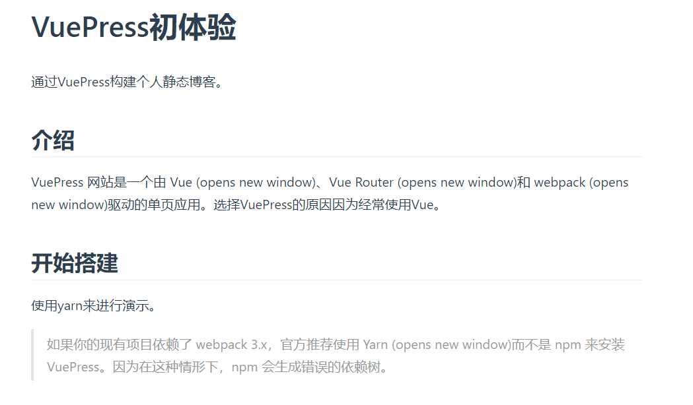
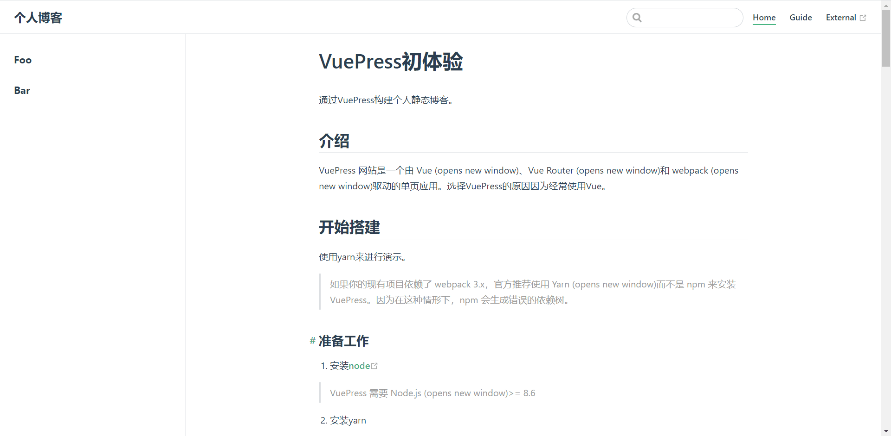

# VuePress初体验
通过VuePress构建个人静态博客。

## 介绍
VuePress 网站是一个由 Vue (opens new window)、Vue Router (opens new window)和 webpack (opens new window)驱动的单页应用。选择VuePress的原因因为经常使用Vue。

## 开始搭建
使用yarn来进行演示。
> 如果你的现有项目依赖了 webpack 3.x，官方推荐使用 Yarn (opens new window)而不是 npm 来安装 VuePress。因为在这种情形下，npm 会生成错误的依赖树。
### 准备工作
1. 安装[node](https://nodejs.org/en/)
> VuePress 需要 Node.js (opens new window)>= 8.6
2. 安装yarn
```
npm install yarn -g
```
准备工作完成，接下来开始搭建。
### 初始化项目
1. 创建并进入一个新目录
```
mkdir blog && cd blog
```
2. 使yarn进行初始化
```
yarn init
```
3. 将 VuePress 安装为本地依赖
```
yarn add -D vuepress
```
4. 创建你的第一篇文档
```
mkdir docs && echo '# Hello VuePress' > docs/README.md
```
5. 在package.json 中添加一些 scripts
```
{
  "scripts": {
    "docs:dev": "vuepress dev docs",
    "docs:build": "vuepress build docs"
  }
}
```
6. 在本地启动服务器
```
yarn docs:dev
```
VuePress 会在 http://localhost:8080 (opens new window)启动一个热重载的开发服务器。

现在已经有了一个简单可用的 VuePress 文档。接下来，了解一下推荐的 目录结构 和 VuePress 中的 基本配置。

### 目录结构
VuePress 遵循 “约定优于配置” 的原则，推荐的目录结构如下：
```
.
├── docs
│   ├── .vuepress (可选的)
│   │   ├── components (可选的)
│   │   ├── theme (可选的)
│   │   │   └── Layout.vue
│   │   ├── public (可选的)
│   │   ├── styles (可选的)
│   │   │   ├── index.styl
│   │   │   └── palette.styl
│   │   ├── templates (可选的, 谨慎配置)
│   │   │   ├── dev.html
│   │   │   └── ssr.html
│   │   ├── config.js (可选的)
│   │   └── enhanceApp.js (可选的)
│   │ 
│   ├── README.md
│   ├── guide
│   │   └── README.md
│   └── config.md
│ 
└── package.json
```
很多文件是可选的，我们自己生成目录，不涉及的文件可以省略掉。如下基本配置。
### 基本配置
1. 生成基本目录，创建`.vuepress`如下：
```
.
├─ docs
│  ├─ README.md
│  └─ .vuepress
│     └─ config.js
└─ package.json
```
2. 配置`.vuepress/config.js`文件：
```
module.exports = {
  title: '个人博客',
  description: '个人博客，用于技术博客、技术分享、文章整理。'
}
```
3. 配置`package.json`文件：
```
"scripts": {
  "start": "npm run dev",
  "dev": "vuepress dev docs",
  "build": "vuepress build docs"
}
```
4. 在`.vuepress/README.md`添加内容，并运行`yarn start`：


## 进一步完善配置
进行[vuepress配置](https://www.vuepress.cn/config/)。
我们使用vuepress的[默认主题](https://www.vuepress.cn/theme/default-theme-config.html)，配置首页、导航栏等。
### 首页
默认的主题提供了一个首页（Homepage）的布局 ([用于 这个网站的主页](https://www.vuepress.cn/))。想要使用它，需要在你的根级 README.md 的 [YAML front matter](https://jekyllrb.com/docs/front-matter/) 指定 home: true。以下是一个如何使用的例子：
```
---
home: true
heroImage: /hero.png
heroText: Hero 标题
tagline: Hero 副标题
actionText: 快速上手 →
actionLink: /zh/guide/
features:
- title: 简洁至上
  details: 以 Markdown 为中心的项目结构，以最少的配置帮助你专注于写作。
- title: Vue驱动
  details: 享受 Vue + webpack 的开发体验，在 Markdown 中使用 Vue 组件，同时可以使用 Vue 来开发自定义主题。
- title: 高性能
  details: VuePress 为每个页面预渲染生成静态的 HTML，同时在页面被加载的时候，将作为 SPA 运行。
footer: MIT Licensed | Copyright © 2018-present Evan You
---
```
### 导航栏
导航栏可能包含你的页面标题、搜索框、 导航栏链接、多语言切换、仓库链接，它们均取决于你的配置。在`.vuepress/config.js`文件中进行配置：
1. 导航栏logo
```
module.exports = {
  themeConfig: {
    logo: '/assets/img/logo.png',
  }
}
```
2. 导航栏链接
```
module.exports = {
  themeConfig: {
    nav: [
      { text: 'Home', link: '/' },
      { text: 'Guide', link: '/guide/' },
      { text: 'External', link: 'https://google.com' },
    ]
  }
}
```
3. 侧边栏
创建bar.md和foo.md。
```
.
├── docs
│   ├── .vuepress
│   │   └──config.js
│   ├── bar.md
│   ├── foo.md
│   └── README.md
├── package.json
└── yarn.lock
```

4. `yarn statr`运行查看结果。



## 主题
1. 选择一个主题，当前选择为[`vuepress-theme-vdoing`](https://doc.xugaoyi.com/)，进行安装：
```
yarn add vuepress-theme-vdoing -D
```
2. 在.vuepress/config.js中配置使用主题：
```
module.exports = {
  theme: 'vdoing'
}
```